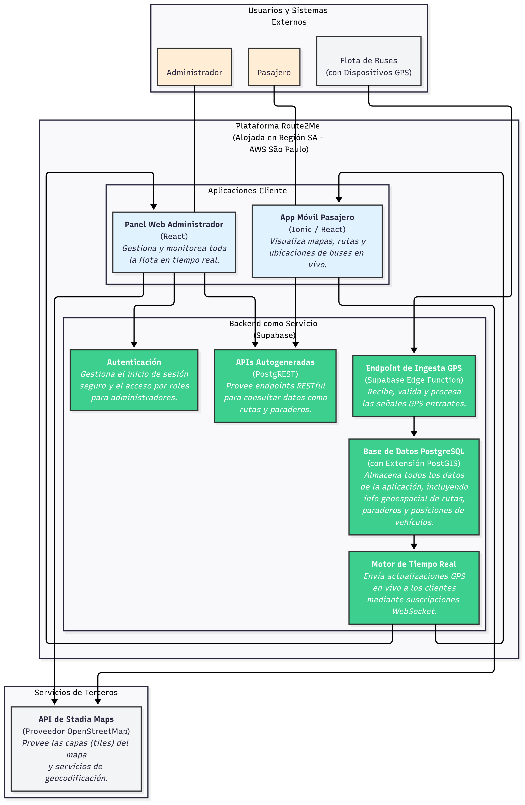

## **Arquitectura Conceptual del Sistema Route2Me**

La arquitectura de **Route2Me** está diseñada como un sistema moderno, escalable y rentable, centrado en una plataforma de **Backend como Servicio (BaaS)** para acelerar el desarrollo y reducir la carga operativa. El objetivo principal es procesar y visualizar un flujo constante de datos de geolocalización en tiempo real para mejorar la experiencia de los pasajeros y la gestión de los administradores de flotas.

Los pilares tecnológicos de esta arquitectura son:
* **Aplicaciones Cliente Multiplataforma**: Se utiliza **Ionic con React** para desarrollar una única base de código que funciona tanto en la web como en dispositivos móviles, maximizando la productividad del equipo de desarrollo.
* **Backend Centralizado (Supabase)**: En lugar de construir y mantener un backend tradicional, se opta por **Supabase**. Esta plataforma proporciona una base de datos PostgreSQL gestionada, autenticación, APIs automáticas y un motor de tiempo real, lo que permite al equipo centrarse en las funcionalidades del producto.
* **Base de Datos Geoespacial**: El núcleo del sistema es una base de datos **PostgreSQL** con la extensión **PostGIS**. Esta elección es fundamental para realizar consultas geoespaciales complejas (como "buscar paraderos cercanos") de manera eficiente y a un costo predecible, ideal para la carga de trabajo de alta escritura del proyecto.
* **Servicios de Mapas Sostenibles**: Para la visualización de mapas, se integra la **API de Stadia Maps** (un proveedor basado en OpenStreetMap) para evitar los costos potencialmente exponenciales de otros proveedores premium, garantizando la viabilidad financiera del proyecto a largo plazo.

---

## **Desglose de Componentes (Paso a Paso)**

Cada parte del diagrama cumple una función específica dentro del ecosistema.

### **1. Usuarios y Sistemas Externos**
Estos son los actores y sistemas que interactúan con la plataforma desde el exterior.
* **Pasajero**: El usuario final de la aplicación móvil. Busca reducir la incertidumbre de su viaje obteniendo información en tiempo real sobre rutas, paraderos y la ubicación de los buses.
* **Administrador**: El gestor de la flota de transporte. Utiliza el panel web para monitorear la operación en vivo, optimizar rutas y tomar decisiones basadas en datos.
* **Flota de Buses (con Dispositivos GPS)**: El origen de los datos en tiempo real. Cada bus está equipado con un dispositivo GPS que envía su ubicación periódicamente a la plataforma.

### **2. Plataforma Route2Me**
Este es el núcleo del sistema, compuesto por las aplicaciones cliente y el backend.

#### **Aplicaciones Cliente**
* **App Móvil Pasajero (Ionic / React)**: La interfaz para los pasajeros. Sus funcionalidades clave incluyen la visualización de rutas en un mapa, la localización de paraderos cercanos, el seguimiento en vivo de un bus y la estimación de su tiempo de llegada (ETA).
* **Panel Web Administrador (React)**: La herramienta para los administradores. Permite ver la ubicación de toda la flota en un único mapa y consultar datos específicos de cada vehículo, como su ruta y nivel de ocupación.

#### **Backend como Servicio (Supabase)**
* **Endpoint de Ingesta GPS (Supabase Edge Function)**: Es la puerta de entrada para los datos de los buses. Este microservicio recibe, valida y procesa las coordenadas GPS antes de almacenarlas.
* **Base de Datos PostgreSQL (con PostGIS)**: El "cerebro" del sistema. Almacena toda la información geoespacial (rutas, polígonos, paraderos) y operativa (horarios, estado de los buses, posiciones en tiempo real).
* **Motor de Tiempo Real**: El componente que permite la magia del "en vivo". Cuando la base de datos recibe una nueva ubicación de un bus, este motor la notifica instantáneamente a todas las aplicaciones cliente conectadas mediante suscripciones WebSocket.
* **APIs Autogeneradas (PostgREST)**: Supabase crea automáticamente una API RESTful sobre la base de datos. Las aplicaciones cliente la utilizan para consultas iniciales, como cargar el listado de todas las rutas disponibles al iniciar la app.
* **Autenticación**: Servicio que gestiona el inicio de sesión seguro y los permisos para los administradores, asegurando que solo personal autorizado pueda acceder al panel de control.

### **3. Servicios de Terceros**
* **API de Stadia Maps**: Proporciona las "capas" o "tiles" visuales que componen el mapa de fondo sobre el cual se dibujan las rutas y los buses. Es un servicio externo esencial para el contexto visual de la aplicación.

---

## **Flujo de Funcionamiento General**

El funcionamiento del sistema se puede resumir en el siguiente ciclo de datos e interacción:

1.  **Generación de Datos**: Un bus de la flota envía su ubicación GPS al **Endpoint de Ingesta GPS** de la plataforma.
2.  **Almacenamiento**: El endpoint procesa la información y la guarda como una nueva coordenada en la **Base de Datos PostgreSQL**.
3.  **Disparo de Evento en Tiempo Real**: El cambio en la base de datos activa automáticamente el **Motor de Tiempo Real**.
4.  **Distribución de Datos**: El motor de tiempo real envía la nueva ubicación a todos los clientes (tanto la app del pasajero como el panel del administrador) que estén suscritos a esa ruta o vehículo.
5.  **Visualización en el Cliente**: Las aplicaciones reciben la actualización y mueven el ícono del bus en el mapa casi instantáneamente. El mapa de fondo sobre el que se mueve el bus es proporcionado por la **API de Stadia Maps**.
6.  **Consulta de Datos Estáticos**: Cuando un usuario abre la aplicación por primera vez, esta utiliza las **APIs Autogeneradas** para descargar información que no cambia constantemente, como el trazado completo de las rutas y la ubicación de todos los paraderos.
7.  **Acceso Seguro**: Si el usuario es un administrador, primero debe iniciar sesión a través del servicio de **Autenticación** para poder acceder al panel de monitoreo.
