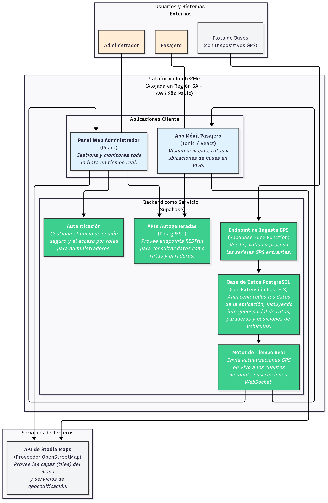
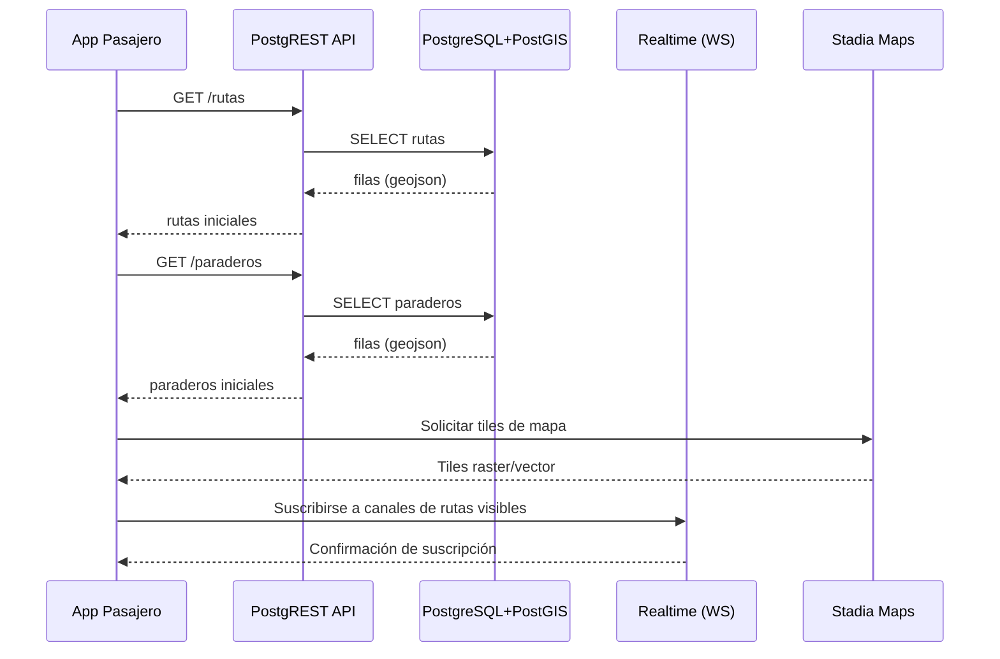
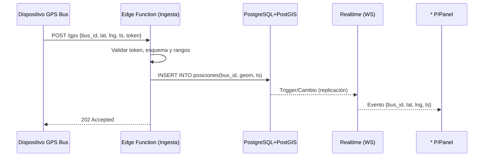
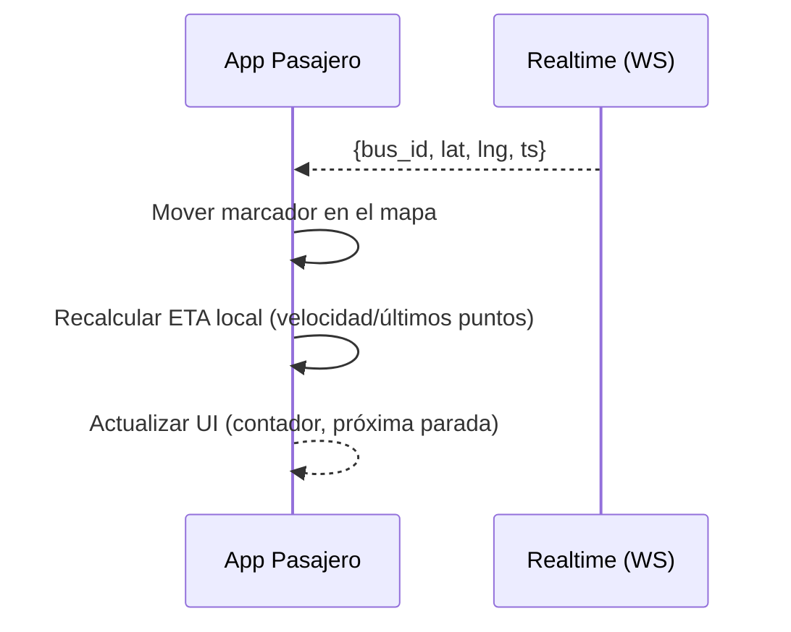
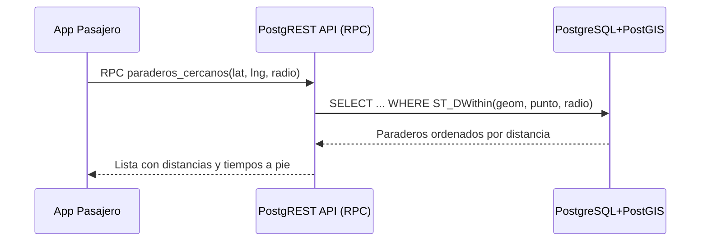
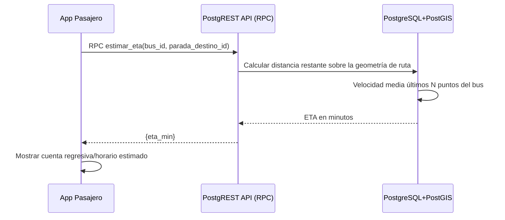
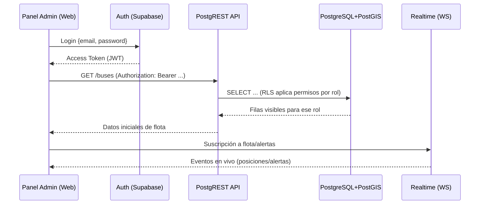
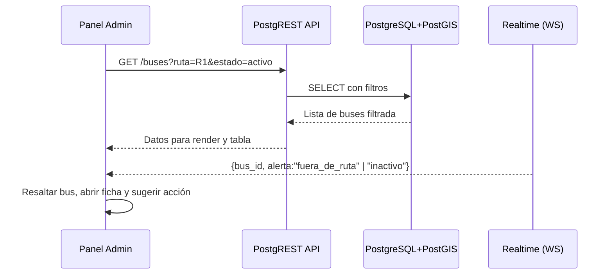
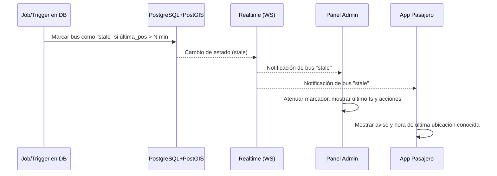
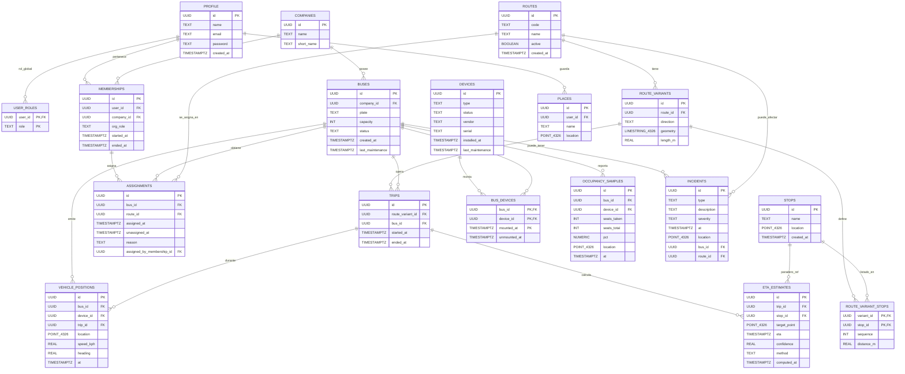

# Route2Me — Plataforma de rastreo y visualización de buses en tiempo real

Sistema moderno, escalable y rentable, centrado en **BaaS (Supabase)** + **apps Ionic/React** para procesar y visualizar ubicaciones GPS en vivo.

---

## Arquitectura Conceptual



**Pilares tecnológicos**  
- **Aplicaciones Cliente Multiplataforma:** **Ionic + React** para una sola base de código web/móvil.  
- **Backend como Servicio (Supabase):** PostgreSQL gestionado, Auth, Realtime y APIs autogeneradas (PostgREST).  
- **Base de Datos Geoespacial:** PostgreSQL + **PostGIS** para consultas espaciales eficientes.  
- **Mapas sostenibles:** **Stadia Maps** (OpenStreetMap) para capas/tiles y geocodificación.

---

## Visión del Proyecto

**Problema**  
El transporte público genera incertidumbre para pasajeros (ruta/horarios, buses llenos) y administradores (poca visibilidad en tiempo real).

**Objetivos**  
- **Experiencia del pasajero:** ubicación del bus, ocupación y ETA en tiempo real.  
- **Gestión de flota:** decisiones basadas en datos en vivo para mejorar eficiencia y costos.

**Alcance (MVP)**  
- **Pasajeros (app móvil):** ver rutas y paraderos cercanos; seguimiento en vivo con ocupación y ETA; próxima parada durante el viaje.  
- **Administradores (panel web):** mapa con toda la flota en vivo y datos por vehículo (ruta/ocupación).

**Fuera del MVP (posteriores)**  
Pagos/tarifas, calificaciones, alertas, soporte/objetos perdidos, reportes e IA para demanda, datos de accesibilidad.

**Usuarios**  
- **Pasajeros** de transporte público.  
- **Administradores de flota** (empresas/entidades).

**Restricciones**  
Se requiere GPS en buses y conectividad; factores externos (tráfico/clima) afectan la precisión del ETA. Se prioriza **usabilidad**, **privacidad/seguridad** y **escalabilidad**.

---

## Herramientas seleccionadas

- **Frontend móvil/web:** **Ionic + React**  
- **Mapas:** **Stadia Maps** (OSM)  
- **BaaS:** **Supabase** (PostgreSQL + PostGIS, Auth, Realtime, PostgREST)

**Motivación**  
- **Ionic (React):** acelera desarrollo con un solo código; rendimiento abordable con clustering de marcadores y renderizado por viewport.  
- **Stadia Maps:** modelo de precios sostenible para escenarios en tiempo real.  
- **Supabase:** menos DevOps, base PostgreSQL adecuada para alta escritura y consultas geoespaciales.

---

## Versionado **definitivo** (compatibilidad primero)

> Política: fijar **mayor+menor** con `~x.y.z` (solo acepta parches). Entornos bloqueados con `engines` y `packageManager`.

### Matriz de versiones

| Componente | Versión fijada | Notas |
|---|---:|---|
| **Node.js** | **22.x (LTS)** | `engines.node: "22.x"` |
| **Gestor de paquetes** | **pnpm 10** | `packageManager: "pnpm@10"` |
| **Ionic Framework (React)** | **~8.7.5** | Última 8.x estable |
| **Capacitor (core/cli/android/ios)** | **~6.2.1** | Requiere Node >=18 |
| **React / ReactDOM** | **18.3.1** | Línea 18 estable |
| **React Router DOM** | **6.30.1** | Mantener 6.x inicialmente |
| **Bundler** | **~6.0.0 (Vite)** | Soporta Node 22 |
| **TypeScript** | **5.9.2** | Estable y compatible con React 18 |
| **Pruebas** | **Vitest 3.2.4**, **@testing-library/react 16.3.0** | JSDOM para unit/integration |
| **Linter/Formateo** | **ESLint 8.57.1**, **Prettier 3.6.0** | Flat config opcional |
| **Mapas (raster)** | **Leaflet 1.9.4** | Estable 1.9 |
| **Mapas (vector, opcional)** | **MapLibre GL JS 5.7.2** | Opcional si se usan tiles vector |
| **SDK Supabase JS** | **2.58.0** | Cliente oficial |
| **Supabase CLI** | **2.47.2** | Local dev/migraciones |
| **PostgreSQL (hosted)** | **17.x** | Alinear local con hosted |
| **PostgreSQL (local)** | **17.x** | Igual a remoto |
| **PostGIS** | **3.5.3** | Compatible con PG 17 |

**`package.json` (control de entorno)**

```json
{
  "name": "route2me",
  "private": true,
  "packageManager": "pnpm@10",
  "engines": { "node": "22.x" },
  "overrides": {
    "@types/react": "18.3.3",
    "@types/react-dom": "18.3.0"
  }
}
```

> **Regla de oro Supabase/Postgres**: crea el proyecto hosted primero y fija la misma versión *mayor* de PostgreSQL en local (CLI) para que `db diff` y migraciones no fallen.

---

## Flujos de funcionamiento detallados

### 1) Inicio de la app del pasajero (bootstrap de datos y suscripciones)



Cuando la persona abre la app, primero pedimos las rutas y paraderos para pintar el mapa sin demoras. Mientras llegan los tiles del mapa, la app se suscribe a los canales de tiempo real que correspondan a lo que se ve en pantalla, así cualquier movimiento de buses aparecerá al instante.

### 2) Ingesta de posiciones desde el bus (validación y broadcast)



El rastreador del bus envía su ubicación y el microservicio de ingesta la revisa para evitar datos malos. Si todo está bien, la guarda y ese cambio dispara el sistema en tiempo real, que envía la nueva posición a todas las pantallas que estén escuchando.

### 3) Seguimiento en vivo en el teléfono (render y ETA inmediato)



Cada vez que llega una nueva posición, el ícono del bus se mueve suavemente y la app recalcula el tiempo estimado de llegada con base en la velocidad reciente y la ruta, para que la persona sepa cuánto falta sin tener que tocar nada.

### 4) "Paraderos cercanos a mí" usando PostGIS



Cuando la persona quiere ubicar dónde subirse, la app manda su ubicación y un radio razonable; el servidor geoespacial devuelve los paraderos más próximos ya ordenados, junto con la distancia para que tomar una decisión sea inmediato.

### 5) Estimación de ETA hasta un destino (función almacenada)



Si el usuario elige una parada destino, el sistema calcula cuánto tramo falta sobre la propia línea de la ruta y lo divide por la velocidad real que trae el bus en los últimos minutos. La app lo muestra como un tiempo concreto para llegar.

### 6) Acceso del administrador al panel seguro (Auth + RLS)



El administrador inicia sesión y recibe un token. Toda consulta posterior al API pasa por reglas de seguridad que sólo devuelven lo que le corresponde ver. Con las suscripciones activas, el panel muestra la operación en vivo sin recargar.

### 7) Vista de flota con filtros y alertas (fuera de ruta, inactividad)



El panel permite centrarse en lo importante con filtros simples. Si un bus se sale del trazado o deja de reportar, el sistema lo notifica en tiempo real y el panel lo resalta para actuar rápido.

### 8) Degradación controlada cuando un bus deja de reportar



Si un bus pierde cobertura o el GPS falla, un proceso marca la posición como "vencida" y lo anuncia. La interfaz baja el brillo del ícono, muestra la hora del último reporte y ofrece opciones para que nadie se quede esperando algo que no viene.

### 9) Diagrama de clases



---

## Estructura del repo

```
apps/
  admin-web/           # React
  passenger-app/       # Ionic + React + Capacitor
infra/
  supabase/            # migraciones, policies, seeds
packages/
  shared/              # modelos TS, utils
docs/
  ADR/                 # decisiones de arquitectura
  README.md
.github/
  ISSUE_TEMPLATE/  PULL_REQUEST_TEMPLATE.md  CODEOWNERS
```

---

## Puesta en marcha

```bash
# Requisitos: Node 22.x, pnpm 10, Docker (para Supabase CLI)
pnpm dlx supabase@2 --version        # verificar CLI
pnpm i
pnpm -C apps/passenger-app dev       # arranca Ionic/React
pnpm -C apps/admin-web dev
```
